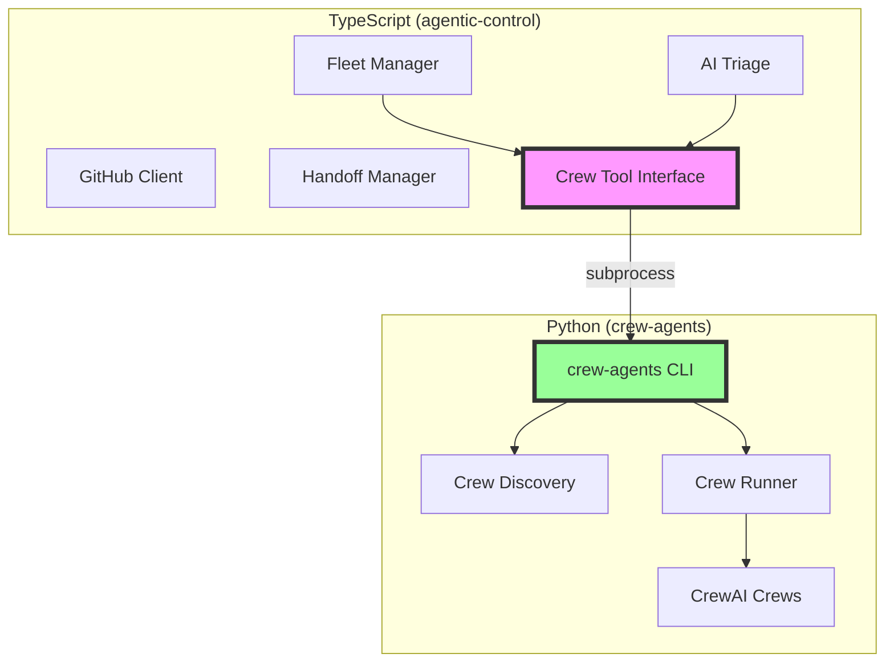
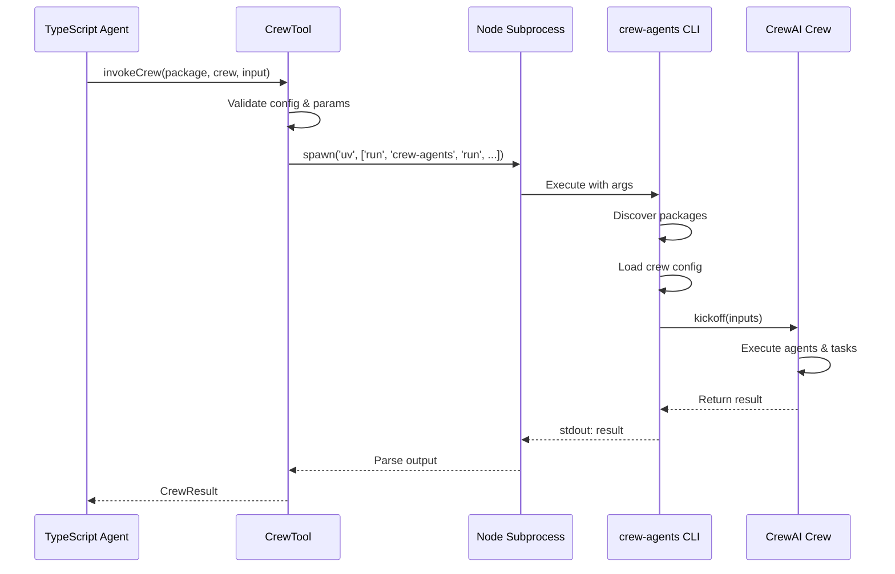

# Design Document

## Overview

This design establishes a comprehensive API documentation strategy and symbiotic integration between the TypeScript agentic-control system and the Python crew-agents system. The integration enables TypeScript components (Fleet, Triage) to invoke Python CrewAI crews as tools via subprocess execution, while maintaining each system's standalone capabilities and clear API boundaries.

### Key Design Principles

1. **Standalone First**: Both TypeScript and Python systems must work independently without requiring the other
2. **Subprocess Integration**: TypeScript invokes Python via subprocess (not shared memory or FFI) for clean separation
3. **Type Safety**: Full TypeScript type definitions for crew invocations with runtime validation
4. **Configuration-Driven**: Crew tool availability and execution parameters controlled via agentic.config.json
5. **Symbiotic Relationship**: Each system plays to its strengths - TypeScript for orchestration, Python for specialized crews

### System Strengths

**TypeScript (agentic-control)**:
- Fleet management and Cursor Background Agent orchestration
- Multi-provider AI triage (Anthropic, OpenAI, Google, Mistral, Azure)
- Multi-organization GitHub token management
- Agent handoff protocols
- Real-time coordination and monitoring

**Python (crew-agents)**:
- Autonomous multi-agent crews for specialized development tasks
- Package-agnostic crew discovery from `.crewai/` directories
- Domain-specific workflows (game design, implementation, asset generation)
- CrewAI framework integration with Anthropic Claude

## Architecture

### Component Diagram



### Integration Flow



## Components and Interfaces

### 1. TypeScript Crew Tool Interface

**Location**: `src/crews/crew-tool.ts`

```typescript
/**
 * Configuration for crew tool execution
 */
export interface CrewToolConfig {
  /** Path to Python executable (default: 'uv') */
  pythonExecutable?: string;
  /** Path to crew-agents package (default: auto-detect) */
  crewAgentsPath?: string;
  /** Default timeout in milliseconds (default: 300000 = 5 minutes) */
  defaultTimeout?: number;
  /** Environment variables to pass to crew execution */
  env?: Record<string, string>;
}

/**
 * Options for invoking a crew
 */
export interface InvokeCrewOptions {
  /** Package name (e.g., 'otterfall') */
  package: string;
  /** Crew name (e.g., 'game_builder') */
  crew: string;
  /** Input specification for the crew */
  input: string;
  /** Optional timeout override in milliseconds */
  timeout?: number;
  /** Optional additional environment variables */
  env?: Record<string, string>;
}

/**
 * Result from crew execution
 */
export interface CrewResult {
  /** Whether execution succeeded */
  success: boolean;
  /** Crew output (if successful) */
  output?: string;
  /** Error message (if failed) */
  error?: string;
  /** Exit code from subprocess */
  exitCode?: number;
  /** Execution time in milliseconds */
  duration: number;
}

/**
 * Information about an available crew
 */
export interface CrewInfo {
  /** Package name */
  package: string;
  /** Crew name */
  name: string;
  /** Crew description */
  description: string;
}

/**
 * Crew tool for invoking Python crew-agents from TypeScript
 */
export class CrewTool {
  constructor(config?: CrewToolConfig);
  
  /**
   * List all available crews across all packages
   */
  async listCrews(): Promise<Result<CrewInfo[]>>;
  
  /**
   * Get detailed information about a specific crew
   */
  async getCrewInfo(package: string, crew: string): Promise<Result<CrewInfo>>;
  
  /**
   * Invoke a crew with the given input
   */
  async invokeCrew(options: InvokeCrewOptions): Promise<CrewResult>;
}
```

### 2. Configuration Schema

**Location**: `src/core/config.ts` (extend existing AgenticConfig)

```typescript
export interface CrewsConfig {
  /** Path to Python executable (default: 'uv') */
  pythonExecutable?: string;
  /** Path to crew-agents package (default: auto-detect from python/ directory) */
  crewAgentsPath?: string;
  /** Default timeout for crew execution in milliseconds */
  defaultTimeout?: number;
  /** Environment variables to pass to all crew executions */
  env?: Record<string, string>;
}

export interface AgenticConfig {
  // ... existing fields ...
  
  /** Crew tool configuration */
  crews?: CrewsConfig;
}
```

**Example Configuration**:

```json
{
  "crews": {
    "pythonExecutable": "uv",
    "crewAgentsPath": "./python",
    "defaultTimeout": 300000,
    "env": {
      "ANTHROPIC_API_KEY": "ANTHROPIC_API_KEY"
    }
  }
}
```

### 3. Python CLI Interface

**Location**: `python/src/crew_agents/main.py` (already exists)

The Python CLI already provides the necessary interface:

```bash
# List all crews
crew-agents list

# List crews in a package
crew-agents list <package>

# Run a crew
crew-agents run <package> <crew> --input "specification"

# Get crew info
crew-agents info <package> <crew>
```

### 4. Integration with Triage System

**Location**: `src/triage/analyzer.ts` (extend existing AIAnalyzer)

```typescript
export class AIAnalyzer {
  private crewTool?: CrewTool;
  
  constructor(options: AIAnalyzerOptions) {
    // ... existing initialization ...
    
    // Initialize crew tool if configured
    const crewsConfig = getConfig().crews;
    if (crewsConfig) {
      this.crewTool = new CrewTool(crewsConfig);
    }
  }
  
  /**
   * Delegate a task to a CrewAI crew
   */
  async delegateToCrew(
    package: string,
    crew: string,
    input: string
  ): Promise<CrewResult> {
    if (!this.crewTool) {
      throw new Error('Crew tool not configured');
    }
    
    return this.crewTool.invokeCrew({ package, crew, input });
  }
}
```

### 5. Integration with Fleet System

**Location**: `src/fleet/fleet.ts` (extend existing Fleet)

```typescript
export class Fleet {
  private crewTool?: CrewTool;
  
  constructor(config?: FleetConfig) {
    // ... existing initialization ...
    
    // Initialize crew tool if configured
    const crewsConfig = getConfig().crews;
    if (crewsConfig) {
      this.crewTool = new CrewTool(crewsConfig);
    }
  }
  
  /**
   * Spawn an agent with crew-generated specifications
   */
  async spawnWithCrewSpec(
    repository: string,
    crewPackage: string,
    crewName: string,
    crewInput: string,
    spawnOptions?: Partial<SpawnOptions>
  ): Promise<Result<Agent>> {
    if (!this.crewTool) {
      throw new Error('Crew tool not configured');
    }
    
    // Generate spec using crew
    const crewResult = await this.crewTool.invokeCrew({
      package: crewPackage,
      crew: crewName,
      input: crewInput,
    });
    
    if (!crewResult.success) {
      return {
        success: false,
        error: `Crew execution failed: ${crewResult.error}`,
      };
    }
    
    // Spawn agent with crew-generated spec
    return this.spawn({
      repository,
      task: crewResult.output!,
      ...spawnOptions,
    });
  }
}
```

## Data Models

### CrewToolConfig

Stored in `agentic.config.json` under the `crews` key:

```typescript
interface CrewToolConfig {
  pythonExecutable: string;      // Path to Python (default: 'uv')
  crewAgentsPath: string;         // Path to crew-agents package
  defaultTimeout: number;         // Timeout in ms (default: 300000)
  env: Record<string, string>;    // Environment variables
}
```

### CrewResult

Returned from crew invocations:

```typescript
interface CrewResult {
  success: boolean;     // Whether execution succeeded
  output?: string;      // Crew output (if successful)
  error?: string;       // Error message (if failed)
  exitCode?: number;    // Process exit code
  duration: number;     // Execution time in ms
}
```

### CrewInfo

Information about available crews:

```typescript
interface CrewInfo {
  package: string;      // Package name (e.g., 'otterfall')
  name: string;         // Crew name (e.g., 'game_builder')
  description: string;  // Crew description
}
```

## Correctness Properties

*A property is a characteristic or behavior that should hold true across all valid executions of a system-essentially, a formal statement about what the system should do. Properties serve as the bridge between human-readable specifications and machine-verifiable correctness guarantees.*


### Property Reflection

Before defining properties, I've reviewed all testable criteria to eliminate redundancy:

**Redundancy Analysis**:
- Properties 3.2, 7.1 are related (both about subprocess spawning) - can be combined
- Properties 3.3, 9.1, 9.2, 9.3, 9.4, 9.5 all relate to error handling - can be consolidated
- Properties 1.2 and 1.3 are parallel (fleet vs triage standalone) - keep separate as they test different modules
- Properties 7.2 and 7.3 relate to execution monitoring - keep separate as they test different aspects

**Consolidated Properties**:
- Subprocess execution and result handling (combines 3.2, 3.5, 7.1)
- Error handling across language boundary (combines 3.3, 9.1-9.5)
- Configuration and validation (combines 5.2, 5.4, 5.5, 6.3, 6.4)

### Correctness Properties

Property 1: Standalone TypeScript fleet operations
*For any* fleet operation (spawn, monitor, coordinate, followup), executing the operation without Python installed should complete successfully using only TypeScript components
**Validates: Requirements 1.2**

Property 2: Standalone TypeScript triage operations
*For any* triage operation (conversation analysis, code review, task extraction), executing the operation without Python installed should complete successfully using only TypeScript components
**Validates: Requirements 1.3**

Property 3: Standalone Python crew operations
*For any* crew operation (list, run, info) via CLI, executing the operation without Node.js installed should complete successfully using only Python components
**Validates: Requirements 2.2**

Property 4: Crew invocation subprocess execution
*For any* valid crew invocation (package, crew, input), the system should spawn a Python subprocess, execute the crew, and return a CrewResult with either success=true and output, or success=false and error
**Validates: Requirements 3.2, 3.5, 7.1**

Property 5: Crew discovery via CLI
*For any* request to list available crews, the system should execute the Python CLI, parse the output, and return a list of CrewInfo objects
**Validates: Requirements 5.2**

Property 6: Configuration environment variable passing
*For any* crew invocation with environment variables in configuration, those environment variables should be passed to the Python subprocess
**Validates: Requirements 5.4**

Property 7: Configuration validation errors
*For any* invalid CrewToolConfig (missing required fields, invalid paths, negative timeouts), the system should throw a validation error with a clear message indicating the problem
**Validates: Requirements 5.5**

Property 8: Input validation before execution
*For any* crew invocation, the system should validate the input parameters (package, crew, input) against Zod schemas before spawning the subprocess
**Validates: Requirements 6.3**

Property 9: Type mismatch error reporting
*For any* crew invocation with invalid parameter types, the system should report a detailed type error at the TypeScript boundary before attempting subprocess execution
**Validates: Requirements 6.4**

Property 10: Stdout and stderr streaming
*For any* crew execution in progress, the system should provide access to stdout and stderr streams to enable progress monitoring
**Validates: Requirements 7.2**

Property 11: Timeout handling
*For any* crew execution that exceeds the configured timeout, the system should terminate the Python subprocess and return a CrewResult with success=false, error indicating timeout, and any partial output captured
**Validates: Requirements 7.3**

Property 12: Timeout override
*For any* crew invocation with a timeout parameter, that timeout should override the default configured timeout
**Validates: Requirements 7.5**

Property 13: Error serialization and preservation
*For any* Python crew that raises an exception, the system should capture the error message and stack trace, serialize it, and return it in the CrewResult error field with sufficient context to identify the failing crew and input
**Validates: Requirements 3.3, 9.1, 9.2, 9.3, 9.5**

Property 14: Error type distinction
*For any* failure during crew execution, the system should distinguish between process communication errors (spawn failure, invalid executable) and crew execution errors (crew raised exception)
**Validates: Requirements 9.4**

Property 15: Integration test error attribution
*For any* integration test failure, the error message should clearly indicate whether the failure occurred in TypeScript code, Python code, or the integration layer (subprocess communication)
**Validates: Requirements 8.4**

## Error Handling

### Error Categories

1. **Configuration Errors**
   - Invalid Python executable path
   - Invalid crew-agents package path
   - Invalid timeout values
   - Missing required configuration

2. **Validation Errors**
   - Invalid package name format
   - Invalid crew name format
   - Missing required parameters
   - Type mismatches

3. **Subprocess Errors**
   - Failed to spawn Python process
   - Python executable not found
   - crew-agents package not found
   - Process terminated unexpectedly

4. **Crew Execution Errors**
   - Crew not found
   - Crew raised exception
   - Invalid crew output format
   - Crew timeout

5. **Communication Errors**
   - Failed to parse crew output
   - Incomplete output received
   - Invalid JSON in output

### Error Handling Strategy

```typescript
class CrewToolError extends Error {
  constructor(
    message: string,
    public category: 'config' | 'validation' | 'subprocess' | 'crew' | 'communication',
    public details?: Record<string, unknown>
  ) {
    super(message);
    this.name = 'CrewToolError';
  }
}

// Example error handling in CrewTool
async invokeCrew(options: InvokeCrewOptions): Promise<CrewResult> {
  try {
    // Validate inputs
    this.validateOptions(options);
    
    // Spawn subprocess
    const proc = spawn(this.config.pythonExecutable, [
      'run', 'crew-agents', 'run',
      options.package, options.crew,
      '--input', options.input
    ]);
    
    // Handle timeout
    const timeout = options.timeout ?? this.config.defaultTimeout;
    const timeoutHandle = setTimeout(() => {
      proc.kill();
    }, timeout);
    
    // Collect output
    let stdout = '';
    let stderr = '';
    
    proc.stdout.on('data', (data) => { stdout += data; });
    proc.stderr.on('data', (data) => { stderr += data; });
    
    // Wait for completion
    const exitCode = await new Promise<number>((resolve) => {
      proc.on('exit', (code) => resolve(code ?? 1));
    });
    
    clearTimeout(timeoutHandle);
    
    // Handle result
    if (exitCode === 0) {
      return {
        success: true,
        output: stdout.trim(),
        exitCode,
        duration: Date.now() - startTime,
      };
    } else {
      return {
        success: false,
        error: stderr || 'Crew execution failed',
        exitCode,
        duration: Date.now() - startTime,
      };
    }
  } catch (error) {
    if (error instanceof CrewToolError) {
      throw error;
    }
    
    throw new CrewToolError(
      `Unexpected error: ${error.message}`,
      'subprocess',
      { originalError: error }
    );
  }
}
```

### Error Recovery

1. **Retry Logic**: For transient subprocess errors, implement exponential backoff retry
2. **Fallback**: If crew execution fails, provide fallback to manual task specification
3. **Logging**: Log all errors with full context for debugging
4. **User Feedback**: Provide actionable error messages with remediation steps

## Testing Strategy

### Unit Tests (TypeScript)

**Location**: `tests/crews/crew-tool.test.ts`

Test coverage:
- Configuration loading and validation
- Parameter validation (Zod schemas)
- Error handling for each error category
- Timeout handling
- Mock subprocess execution

**Example**:
```typescript
describe('CrewTool', () => {
  describe('configuration', () => {
    it('should load configuration from config file', () => {
      // Test config loading
    });
    
    it('should validate Python executable path', () => {
      // Test validation
    });
    
    it('should throw error for invalid timeout', () => {
      // Test error handling
    });
  });
  
  describe('invokeCrew', () => {
    it('should validate required parameters', () => {
      // Test parameter validation
    });
    
    it('should spawn subprocess with correct arguments', () => {
      // Test subprocess spawning (mocked)
    });
    
    it('should handle timeout correctly', () => {
      // Test timeout handling
    });
  });
});
```

### Unit Tests (Python)

**Location**: `python/tests/test_runner.py` (already exists)

Test coverage:
- Crew discovery
- Crew loading
- Crew execution
- Error handling

### Property-Based Tests

**Location**: `tests/crews/crew-tool.property.test.ts`

**Framework**: fast-check (TypeScript property-based testing library)

**Property 4: Crew invocation subprocess execution**
```typescript
import fc from 'fast-check';

describe('CrewTool Properties', () => {
  it('Property 4: Crew invocation subprocess execution', async () => {
    await fc.assert(
      fc.asyncProperty(
        fc.string({ minLength: 1 }), // package
        fc.string({ minLength: 1 }), // crew
        fc.string(), // input
        async (package, crew, input) => {
          const crewTool = new CrewTool(testConfig);
          const result = await crewTool.invokeCrew({ package, crew, input });
          
          // Result should always have success field
          expect(result).toHaveProperty('success');
          expect(typeof result.success).toBe('boolean');
          
          // If successful, should have output
          if (result.success) {
            expect(result).toHaveProperty('output');
            expect(typeof result.output).toBe('string');
          } else {
            // If failed, should have error
            expect(result).toHaveProperty('error');
            expect(typeof result.error).toBe('string');
          }
          
          // Should always have duration
          expect(result).toHaveProperty('duration');
          expect(typeof result.duration).toBe('number');
          expect(result.duration).toBeGreaterThanOrEqual(0);
        }
      ),
      { numRuns: 100 }
    );
  });
});
```

**Property 7: Configuration validation errors**
```typescript
it('Property 7: Configuration validation errors', () => {
  fc.assert(
    fc.property(
      fc.record({
        pythonExecutable: fc.option(fc.string(), { nil: undefined }),
        crewAgentsPath: fc.option(fc.string(), { nil: undefined }),
        defaultTimeout: fc.option(fc.integer(), { nil: undefined }),
      }),
      (config) => {
        // Filter to only invalid configs
        const isInvalid = 
          config.defaultTimeout !== undefined && config.defaultTimeout < 0;
        
        if (!isInvalid) return true;
        
        // Invalid config should throw validation error
        expect(() => new CrewTool(config)).toThrow(CrewToolError);
        expect(() => new CrewTool(config)).toThrow(/validation/i);
        
        return true;
      }
    ),
    { numRuns: 100 }
  );
});
```

**Property 11: Timeout handling**
```typescript
it('Property 11: Timeout handling', async () => {
  await fc.assert(
    fc.asyncProperty(
      fc.integer({ min: 100, max: 1000 }), // timeout in ms
      async (timeout) => {
        const crewTool = new CrewTool({
          ...testConfig,
          defaultTimeout: timeout,
        });
        
        // Create a crew that takes longer than timeout
        const result = await crewTool.invokeCrew({
          package: 'test',
          crew: 'long_running',
          input: 'test',
        });
        
        // Should fail with timeout error
        expect(result.success).toBe(false);
        expect(result.error).toMatch(/timeout/i);
        expect(result.duration).toBeGreaterThanOrEqual(timeout);
        expect(result.duration).toBeLessThan(timeout * 1.5); // Some buffer
      }
    ),
    { numRuns: 50 }
  );
});
```

### Integration Tests

**Location**: `tests/integration/crew-tool-integration.test.ts`

Test coverage:
- End-to-end crew invocation
- TypeScript → Python → TypeScript round trip
- Error propagation across language boundary
- Real subprocess execution (not mocked)

**Example**:
```typescript
describe('CrewTool Integration', () => {
  it('should successfully invoke a real crew', async () => {
    const crewTool = new CrewTool({
      pythonExecutable: 'uv',
      crewAgentsPath: './python',
    });
    
    const result = await crewTool.invokeCrew({
      package: 'test-package',
      crew: 'test-crew',
      input: 'test input',
    });
    
    expect(result.success).toBe(true);
    expect(result.output).toBeDefined();
  });
  
  it('should handle crew errors correctly', async () => {
    const crewTool = new CrewTool(testConfig);
    
    const result = await crewTool.invokeCrew({
      package: 'test-package',
      crew: 'failing-crew',
      input: 'test input',
    });
    
    expect(result.success).toBe(false);
    expect(result.error).toContain('crew error message');
  });
});
```

### Test Utilities

**Location**: `tests/crews/crew-tool.mock.ts`

Provide mock implementations for testing:

```typescript
export class MockCrewTool extends CrewTool {
  private mockResults: Map<string, CrewResult> = new Map();
  
  setMockResult(package: string, crew: string, result: CrewResult): void {
    this.mockResults.set(`${package}:${crew}`, result);
  }
  
  async invokeCrew(options: InvokeCrewOptions): Promise<CrewResult> {
    const key = `${options.package}:${options.crew}`;
    const mockResult = this.mockResults.get(key);
    
    if (mockResult) {
      return mockResult;
    }
    
    return {
      success: true,
      output: `Mock output for ${key}`,
      duration: 100,
    };
  }
}
```

## Documentation Strategy

### TypeScript API Documentation

**Location**: `docs/api/typescript/`

**Generation**: TypeDoc

**Content**:
1. **Module Overview**: Description of each module (fleet, triage, github, handoff, core, crews)
2. **API Reference**: Auto-generated from TSDoc comments
3. **Standalone Examples**: Working examples for each module without Python
4. **Integration Examples**: Examples showing crew tool usage

**Example TSDoc**:
```typescript
/**
 * Crew tool for invoking Python crew-agents from TypeScript
 * 
 * @example Standalone usage (without crews)
 * ```typescript
 * import { Fleet } from 'agentic-control';
 * 
 * const fleet = new Fleet();
 * await fleet.spawn({
 *   repository: 'https://github.com/org/repo',
 *   task: 'Fix the bug',
 * });
 * ```
 * 
 * @example With crew integration
 * ```typescript
 * import { Fleet, CrewTool } from 'agentic-control';
 * 
 * const fleet = new Fleet();
 * const crewTool = new CrewTool();
 * 
 * // Generate spec using crew
 * const spec = await crewTool.invokeCrew({
 *   package: 'otterfall',
 *   crew: 'game_builder',
 *   input: 'Create a QuestComponent',
 * });
 * 
 * // Spawn agent with crew-generated spec
 * await fleet.spawn({
 *   repository: 'https://github.com/org/repo',
 *   task: spec.output,
 * });
 * ```
 */
export class CrewTool {
  // ...
}
```

### Python API Documentation

**Location**: `docs/api/python/`

**Generation**: Sphinx with autodoc

**Content**:
1. **Module Overview**: Description of flows, crews, core, tools
2. **API Reference**: Auto-generated from docstrings
3. **Standalone Examples**: CLI and programmatic usage without Node.js
4. **Integration Examples**: How Python crews can be invoked from TypeScript

**Example Docstring**:
```python
"""Run a crew from a package with the given inputs.

This function can be used standalone without Node.js:

.. code-block:: python

    from crew_agents.core.runner import run_crew
    
    result = run_crew(
        package_name='otterfall',
        crew_name='game_builder',
        inputs={'spec': 'Create a QuestComponent'}
    )
    print(result)

Or invoked from TypeScript via the CrewTool:

.. code-block:: typescript

    const crewTool = new CrewTool();
    const result = await crewTool.invokeCrew({
      package: 'otterfall',
      crew: 'game_builder',
      input: 'Create a QuestComponent',
    });

Args:
    package_name: Name of the package (e.g., 'otterfall').
    crew_name: Name of the crew to run (e.g., 'game_builder').
    inputs: Optional dict of inputs to pass to the crew.
    workspace_root: Optional workspace root path.

Returns:
    The crew's output as a string.

Raises:
    ValueError: If package or crew not found.
"""
```

### Architecture Documentation

**Location**: `docs/architecture.md`

**Content**:
1. **System Overview**: High-level architecture diagram
2. **Component Descriptions**: Detailed description of TypeScript and Python components
3. **Standalone Capabilities**: What each system can do independently
4. **Integration Architecture**: How the systems work together
5. **Symbiotic Relationship**: When to use each component
6. **Sequence Diagrams**: Request-response flows
7. **Configuration Guide**: How to configure the integration

**Example Section**:
```markdown
## Symbiotic Relationship

### TypeScript Strengths (agentic-control)

- **Orchestration**: Managing multiple agents across repositories
- **Fleet Management**: Spawning, monitoring, coordinating Cursor Background Agents
- **Multi-Provider AI**: Flexible AI provider selection (Anthropic, OpenAI, Google, etc.)
- **GitHub Operations**: Multi-org token management, PR operations
- **Real-time Coordination**: Bidirectional communication via PR comments

**Use TypeScript when**: You need to orchestrate agents, manage GitHub operations, or perform AI analysis with provider flexibility.

### Python Strengths (crew-agents)

- **Specialized Crews**: Autonomous multi-agent teams for specific domains
- **Development Workflows**: Game design, implementation, asset generation
- **CrewAI Framework**: Leveraging CrewAI's agent orchestration
- **Domain Knowledge**: Crews with specialized knowledge bases

**Use Python when**: You need specialized autonomous crews for complex development tasks.

### Integration Pattern

TypeScript agents can delegate specialized tasks to Python crews:

1. **Task Identification**: TypeScript triage identifies a specialized task
2. **Crew Selection**: Select appropriate crew (e.g., game_builder)
3. **Crew Invocation**: Invoke crew via CrewTool with task specification
4. **Result Integration**: Use crew output to spawn agents or create issues
```

### Integration Examples

**Location**: `docs/examples/integration/`

**Examples**:
1. **Fleet with Crew Spec**: Spawn agent with crew-generated specification
2. **Triage with Crew Delegation**: Delegate analysis task to crew
3. **Error Handling**: Handle crew execution errors
4. **Configuration**: Configure crew tool in agentic.config.json

## Implementation Notes

### Subprocess Execution

Use Node.js `child_process.spawn` for subprocess execution:

```typescript
import { spawn } from 'child_process';

const proc = spawn(pythonExecutable, [
  'run', 'crew-agents', 'run',
  packageName, crewName,
  '--input', input
], {
  env: { ...process.env, ...additionalEnv },
  cwd: crewAgentsPath,
});
```

### Output Parsing

Crew output is plain text. Parse it as-is:

```typescript
let stdout = '';
proc.stdout.on('data', (data) => {
  stdout += data.toString();
});

// On completion
const output = stdout.trim();
```

### Timeout Implementation

Use `setTimeout` to kill process after timeout:

```typescript
const timeoutHandle = setTimeout(() => {
  proc.kill('SIGTERM');
  setTimeout(() => proc.kill('SIGKILL'), 5000); // Force kill after 5s
}, timeout);

proc.on('exit', () => {
  clearTimeout(timeoutHandle);
});
```

### Configuration Validation

Use Zod for runtime validation:

```typescript
import { z } from 'zod';

const CrewToolConfigSchema = z.object({
  pythonExecutable: z.string().default('uv'),
  crewAgentsPath: z.string().optional(),
  defaultTimeout: z.number().positive().default(300000),
  env: z.record(z.string()).optional(),
});

export function validateConfig(config: unknown): CrewToolConfig {
  return CrewToolConfigSchema.parse(config);
}
```

### Python Executable Detection

Auto-detect Python executable if not configured:

```typescript
function detectPythonExecutable(): string {
  // Try uv first (preferred)
  if (commandExists('uv')) {
    return 'uv';
  }
  
  // Fall back to python3
  if (commandExists('python3')) {
    return 'python3';
  }
  
  // Fall back to python
  if (commandExists('python')) {
    return 'python';
  }
  
  throw new Error('No Python executable found');
}
```

### crew-agents Path Detection

Auto-detect crew-agents package location:

```typescript
function detectCrewAgentsPath(): string {
  // Check if python/ directory exists in workspace
  const pythonDir = path.join(process.cwd(), 'python');
  if (fs.existsSync(pythonDir)) {
    return pythonDir;
  }
  
  // Check if installed globally
  // (uv will handle this automatically)
  return process.cwd();
}
```
